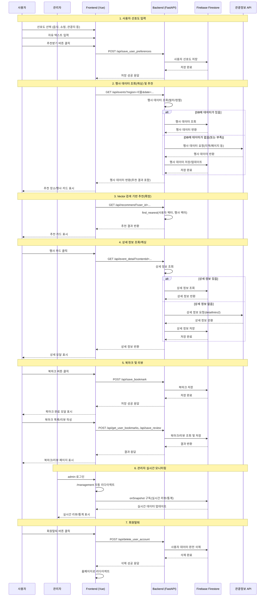
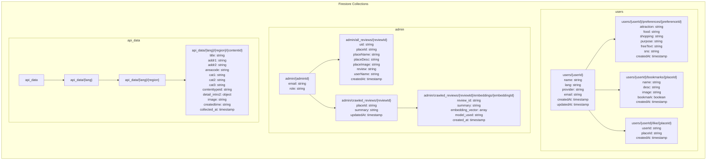

# SOYO (소요) - 여행 추천 AI 서비스


**Search for your Own Oasis**의 줄임말이자, 한자어 소요(逍遙) '자유롭게 거닐다'는 의미를 담은 외국인을 위한 맞춤형 한국 여행 추천 서비스입니다.

## 🚀 주요 기능

- **다국어 지원**: 한국어, 영어, 중국어, 일본어
- **개인화 추천**: 사용자 선호도 기반 여행지 추천
- **북마크 기능**: 관심 장소 저장 및 관리 (2초간 연속 클릭 방지)
- **리뷰 시스템**: 각 장소별 개별 리뷰 작성 및 수정
- **실시간 관리자 페이지**: Firestore onSnapshot으로 실시간 리뷰/통계 동기화
- **회원탈퇴**: 북마크 페이지에서 직접 계정 삭제
- **모바일 최적화**: 반응형 디자인

## 🛠️ 기술 스택

### Frontend


### Backend


### Database & Authentication


### Tools & Others


[](https://huggingface.co/Pokqok/m2m100-onnx-ko-to-ja-zh-k-tourism)
[
[](https://hub.docker.com/r/pokqok/sbert-pinecone-api)
[](https://hub.docker.com/r/pokqok/m2m100-k-tourism-ko-ja-zh-onnx)
[


## 📱 시스템 아키텍처

### 시퀀스 다이어그램



### 데이터베이스 구조 (Firestore NoSQL)



## 🚀 설치 및 실행

### 📋 사전 요구사항

- Python 3.8 이상
- Node.js 16 이상
- npm 또는 yarn

### 🚀 빠른 시작 (권장)

프로젝트 루트 폴더에서 다음 명령어를 실행하세요:

```powershell
.\all.ps1
```

### 🌐 접속 정보

- **프론트엔드**: http://localhost:5173
- **백엔드 API**: http://localhost:8000

### 📝 주의사항

1. 백엔드 실행 전 `firebase.json` 파일이 `backend` 폴더에 있어야 합니다
2. 가상환경 활성화 후 백엔드를 실행해야 합니다
3. 프론트엔드는 별도 터미널에서 실행해야 합니다

### 🔍 문제 해결

- 포트 충돌 시: 다른 포트 사용 또는 기존 프로세스 종료
- 의존성 오류: `pip install -r requirements.txt` 재실행
- npm 오류: `npm install` 재실행

## 📋 API 엔드포인트

### 사용자 선호도

- `POST /api/save_user_preferences` - 선호도 저장
- `POST /api/get_latest_user_preferences` - 최신 선호도 조회

### 북마크

- `POST /api/save_bookmark` - 북마크 저장
- `POST /api/get_user_bookmarks` - 북마크 목록 조회
- `POST /api/delete_user_bookmark` - 북마크 삭제

### 리뷰

- `POST /api/save_review` - 리뷰 저장/수정
- `POST /api/get_user_reviews` - 사용자 리뷰 조회
- `GET /api/get_all_reviews` - 전체 리뷰 조회 (관리자용)

### 사용자 관리

- `POST /api/update_user_language` - 언어 설정 업데이트
- `POST /api/delete_user_account` - 회원탈퇴

## 🌟 주요 페이지

1. **홈페이지** (`/`) - 언어 선택 및 로그인
2. **목적지 선택** (`/destination`) - 여행 목적지 입력
3. **선호도 입력** (`/preference`) - 개인 취향 설정
4. **추천 결과** (`/recommend`) - 맞춤형 추천 결과
5. **북마크 목록** (`/bookmarks`) - 저장된 장소 관리 및 리뷰
6. **관리자 페이지** (`/management`) - 실시간 리뷰/통계 관리 (관리자 계정만 접근가능)

## 🔧 주요 기능 상세

### 관리자 페이지 (Management.vue)

- **자동 리다이렉트**: 관리자 계정으로 로그인 시 자동으로 `/management`로 이동
- **실시간 동기화**: Firestore onSnapshot으로 리뷰/통계 실시간 업데이트
- **통계 대시보드**: 전체 사용자 수, 북마크 수, 리뷰 수, 장소별 통계
- **리뷰 관리**: 모든 사용자의 리뷰를 시간순으로 확인

### 북마크 UX 개선

- **연속 클릭 방지**: 북마크 버튼 클릭 후 2초간 비활성화
- **정확한 메시지**: 추가/삭제 성공/실패 메시지 분기
- **개별 리뷰**: 각 북마크마다 개별 리뷰 작성/수정 가능

### 회원탈퇴

- **완전 삭제**: 사용자 데이터, 북마크, 리뷰, 선호도 모두 삭제
- **Firebase Auth**: Firebase Auth 계정도 함께 삭제

## 👥 Credits

이 프로젝트는 다음 팀원들의 협력으로 개발되었습니다:

| 최정훈 (팀장)                                                                                                                               | 안효서                                                                                                                             | 박지연                                                                                                                               | 이서준                                                                                                                                | 이재진                                                                                                                                  |
| ------------------------------------------------------------------------------------------------------------------------------------------- | ---------------------------------------------------------------------------------------------------------------------------------- | ------------------------------------------------------------------------------------------------------------------------------------ | ------------------------------------------------------------------------------------------------------------------------------------- | --------------------------------------------------------------------------------------------------------------------------------------- |
| [](https://github.com/Jeonghoonchoi74) | [](https://github.com/pokqok) | [](https://github.com/jiyeon22) | [](https://github.com/seojun133) | [](https://github.com/LeeJaeJin00) |

## 📄 라이선스

이 프로젝트는 [MIT 라이선스](LICENSE) 하에 배포됩니다.

[](LICENSE)
