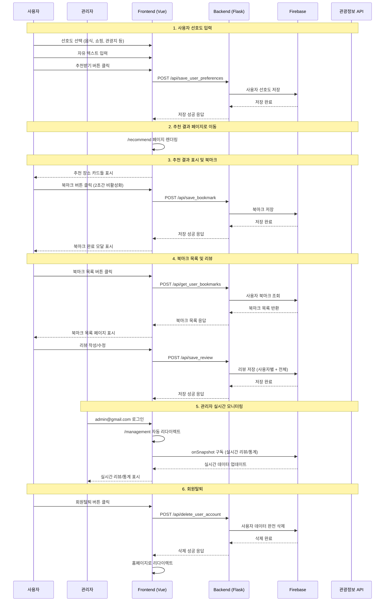
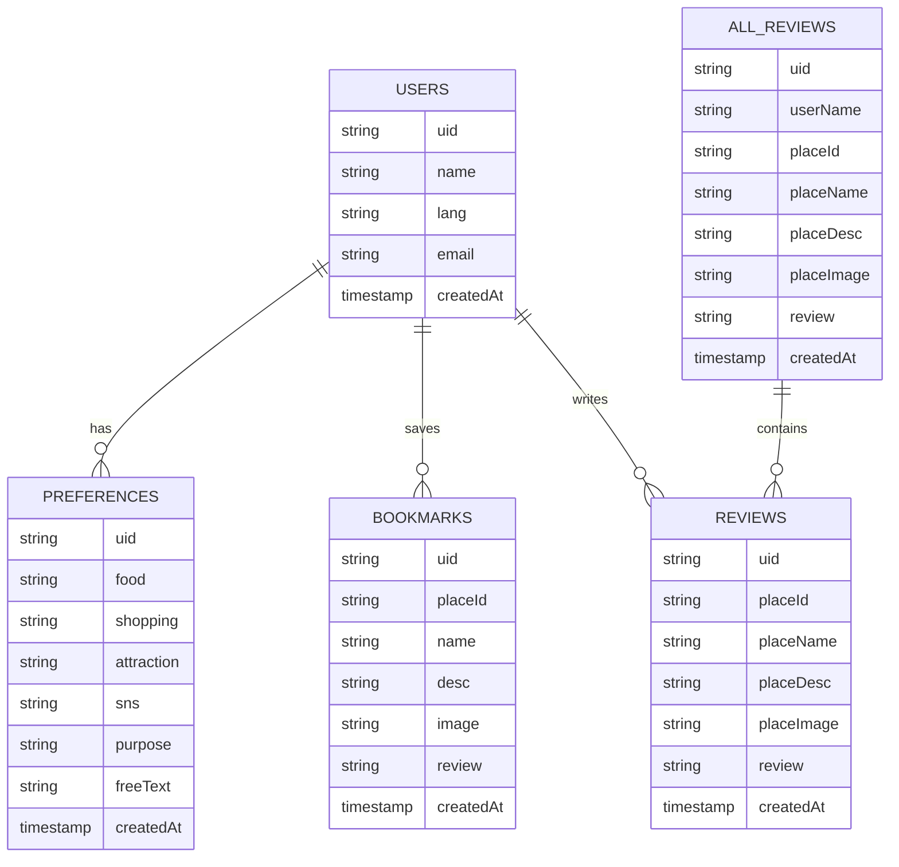
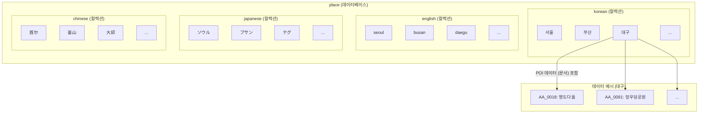

# 여행 추천 AI 서비스

외국인을 위한 맞춤형 한국 여행 추천 서비스입니다.

## 🚀 주요 기능

- **다국어 지원**: 한국어, 영어, 중국어, 일본어
- **개인화 추천**: 사용자 선호도 기반 여행지 추천
- **북마크 기능**: 관심 장소 저장 및 관리 (2초간 연속 클릭 방지)
- **리뷰 시스템**: 각 장소별 개별 리뷰 작성 및 수정
- **실시간 관리자 페이지**: Firestore onSnapshot으로 실시간 리뷰/통계 동기화
- **회원탈퇴**: 북마크 페이지에서 직접 계정 삭제
- **모바일 최적화**: 반응형 디자인

## 🛠️ 기술 스택

- **Frontend**: Vue.js 3, Vite
- **Backend**: Flask, Python
- **Database**: Firebase Firestore (실시간 동기화)
- **Authentication**: Firebase Auth
- **API**: 국문관광정보 서비스 API

## 📱 시스템 아키텍처

### 시퀀스 다이어그램



### 데이터베이스 구조



#### place 컬렉션 구조 (다국어 지역별 POI 데이터)

- **place** 데이터베이스는 언어별 컬렉션(`korean`, `english`, `japanese`, `chinese`)로 구성되어 있습니다.
- 각 컬렉션은 지역별 문서(`서울`, `부산`, `대구` 등)를 포함하며, 각 지역 문서에는 POI(관광지) 데이터가 저장됩니다.
- 예시: `korean/대구/AA_0018` → "영도다움" POI 데이터



## 🚀 설치 및 실행

### 1. 저장소 클론
```bash
git clone [repository-url]
cd project
```

### 2. Backend 설정
```bash
cd backend
python -m venv venv
source venv/bin/activate  # Windows: venv\Scripts\activate
pip install -r requirements.txt
python app.py
```

### 3. Frontend 설정
```bash
cd frontend
npm install
npm run dev
```

### 4. 환경 변수 설정
Firebase 설정 파일을 `backend/` 디렉토리에 추가하세요.

## 📋 API 엔드포인트

### 사용자 선호도
- `POST /api/save_user_preferences` - 선호도 저장
- `POST /api/get_latest_user_preferences` - 최신 선호도 조회

### 북마크
- `POST /api/save_bookmark` - 북마크 저장
- `POST /api/get_user_bookmarks` - 북마크 목록 조회
- `POST /api/delete_user_bookmark` - 북마크 삭제

### 리뷰
- `POST /api/save_review` - 리뷰 저장/수정
- `POST /api/get_user_reviews` - 사용자 리뷰 조회
- `GET /api/get_all_reviews` - 전체 리뷰 조회 (관리자용)

### 통계
- `GET /api/get_statistics` - 전체 통계 조회 (관리자용)

### 사용자 관리
- `POST /api/update_user_language` - 언어 설정 업데이트
- `POST /api/delete_user_account` - 회원탈퇴

## 🌟 주요 페이지

1. **홈페이지** (`/`) - 언어 선택 및 로그인
2. **목적지 선택** (`/destination`) - 여행 목적지 입력
3. **선호도 입력** (`/preference`) - 개인 취향 설정
4. **추천 결과** (`/recommend`) - 맞춤형 추천 결과
5. **북마크 목록** (`/bookmarks`) - 저장된 장소 관리 및 리뷰
6. **관리자 페이지** (`/management`) - 실시간 리뷰/통계 관리 (admin@gmail.com만 접근)

## 🔧 주요 기능 상세

### 관리자 페이지 (Management.vue)
- **자동 리다이렉트**: admin@gmail.com 로그인 시 자동으로 `/management`로 이동
- **실시간 동기화**: Firestore onSnapshot으로 리뷰/통계 실시간 업데이트
- **통계 대시보드**: 전체 사용자 수, 북마크 수, 리뷰 수, 장소별 통계
- **리뷰 관리**: 모든 사용자의 리뷰를 시간순으로 확인

### 북마크 UX 개선
- **연속 클릭 방지**: 북마크 버튼 클릭 후 2초간 비활성화
- **정확한 메시지**: 추가/삭제 성공/실패 메시지 분기
- **개별 리뷰**: 각 북마크마다 개별 리뷰 작성/수정 가능

### 회원탈퇴
- **완전 삭제**: 사용자 데이터, 북마크, 리뷰, 선호도 모두 삭제
- **Firebase Auth**: Firebase Auth 계정도 함께 삭제

## 🔮 향후 계획

- [ ] 관광정보 API 연동
- [ ] AI 기반 추천 알고리즘 개선
- [ ] 지도 연동 기능
- [ ] 실시간 번역 기능
- [ ] 소셜 로그인 추가
- [ ] 리뷰 평점 시스템
- [ ] 관리자 대시보드 확장

## 📄 라이선스

이 프로젝트는 MIT 라이선스 하에 배포됩니다.

