# SOYO (소요) - 여행 추천 AI 서비스


**Search for your Own Oasis**의 줄임말이자, 한자어 소요(逍遙) '자유롭게 거닐다'는 의미를 담은 **외국인을 위한 맞춤형 한국 여행 추천 AI 서비스**입니다.

> **다국어 지원**과 **AI 기반 개인화 추천**으로 한국 여행의 모든 순간을 특별하게 만들어드립니다.

## 주요 기능

### 다국어 지원
- **4개 언어 지원**: 한국어, 영어, 중국어, 일본어
- **실시간 번역**: AI 기반 자동 번역으로 언어 장벽 해소
- **언어별 맞춤 UI**: 각 언어에 최적화된 사용자 인터페이스

### AI 기반 개인화 추천
- **선호도 분석**: 음식, 쇼핑, 관광지 등 개인 취향 기반 추천
- **자유 텍스트 입력**: 자연어로 원하는 여행 스타일 표현
- **실시간 추천**: 사용자 입력에 따른 즉시 맞춤 추천 결과

### 사용자 경험
- **북마크 기능**: 관심 장소 저장 및 관리 (2초간 연속 클릭 방지)
- **리뷰 시스템**: 각 장소별 개별 리뷰 작성 및 수정
- **회원탈퇴**: 북마크 페이지에서 직접 계정 삭제
- **모바일 최적화**: 반응형 디자인으로 모든 기기 지원

### 관리자 기능
- **실시간 관리자 페이지**: Firestore onSnapshot으로 실시간 리뷰/통계 동기화
- **통계 대시보드**: 사용자 수, 북마크 수, 리뷰 수 등 실시간 통계
- **리뷰 관리**: 모든 사용자 리뷰를 시간순으로 모니터링

## 기술 스택

### Frontend


**주요 특징:**
- Vue 3 Composition API 기반 현대적 프론트엔드
- Vite를 통한 빠른 개발 서버 및 빌드
- 반응형 디자인으로 모바일/데스크톱 최적화

### Backend


**주요 특징:**
- FastAPI 기반 고성능 REST API
- 자동 API 문서 생성 (Swagger/OpenAPI)
- 비동기 처리로 높은 동시성 지원

### Database & Authentication


**주요 특징:**
- Firebase Authentication (Google 로그인)
- Firestore NoSQL 실시간 데이터베이스
- 실시간 데이터 동기화 (onSnapshot)

### AI & Machine Learning
[](https://huggingface.co/Pokqok/m2m100-onnx-ko-to-ja-zh-k-tourism)
[](https://huggingface.co/seoseo99/qwen2-1_5b-sum_lk_gemini)

**AI 모델:**
- **M2M100**: 한국 관광 데이터셋으로 파인튜닝된 다국어 번역 모델
- **Qwen2**: 리뷰 요약 및 텍스트 처리용 언어 모델
- **ONNX**: 최적화된 추론 속도

### Container & Deployment
[](https://hub.docker.com/r/pokqok/sbert-pinecone-api)
[](https://hub.docker.com/r/pokqok/m2m100-k-tourism-ko-ja-zh-onnx)
[](https://hub.docker.com/r/seoseo99/review-summary-worker)

**컨테이너화:**
- Docker를 통한 마이크로서비스 아키텍처
- 각 AI 모델별 독립적인 컨테이너
- 확장 가능한 서비스 배포

### Development Tools


## 시스템 아키텍처

### 시퀀스 다이어그램

```mermaid
sequenceDiagram
    participant U as 사용자
    participant A as 관리자
    participant F as Frontend (Vue.js)
    participant B as Backend (FastAPI)
    participant FDB as Firebase Firestore
    participant FA as Firebase Auth
    participant AI as AI 추천 서비스 (localhost:5002)

    Note over U,AI: 1. 사용자 인증 및 언어 설정
    U->>F: 홈페이지 접속 (/)
    F->>FA: 인증 상태 확인
    FA-->>F: 인증 상태 반환
    alt 로그인되지 않은 경우
        F->>U: 언어 선택 모달 표시
        U->>F: 언어 선택 (ko/en/zh/ja)
        F->>U: 로그인/회원가입 페이지 표시 (/auth)
        U->>F: 이메일/비밀번호 입력 또는 Google 로그인
        F->>FA: 사용자 인증 요청
        FA-->>F: 인증 결과 반환
        F->>B: POST /api/register_user (신규 사용자)
        B->>FDB: 사용자 정보 저장
        FDB-->>B: 저장 완료
        B-->>F: 등록 성공
    else 이미 로그인된 경우
        F->>B: POST /api/firebase/get-user-language
        B->>FDB: 사용자 언어 설정 조회
        FDB-->>B: 언어 설정 반환
        B-->>F: 언어 설정 응답
    end
    F->>U: 메인 페이지로 이동 (/main)

    Note over U,AI: 2. 검색 방식 선택
    U->>F: 검색 시작 버튼 클릭
    F->>U: 검색 방식 선택 페이지 표시 (/search)
    U->>F: 검색 방식 선택 (자유 검색/가이드 검색)
    
    alt 자유 검색 선택
        F->>U: 선호도 입력 페이지 표시 (/preference)
        U->>F: 선호도 선택 및 자유 텍스트 입력
        U->>F: 추천받기 버튼 클릭
        F->>B: POST /api/save_user_preferences
        B->>FDB: 사용자 선호도 저장
        FDB-->>B: 저장 완료
        B-->>F: 저장 성공 응답
    else 가이드 검색 선택
        F->>U: 가이드 검색 페이지 표시 (/search/guided)
        U->>F: 단계별 선택 (지역, 카테고리, 세부사항)
        U->>F: 최종 검색어 확인
    end

    Note over U,AI: 3. AI 추천 및 Firebase 데이터 조회
    F->>B: POST /api/recommend/search
    B->>AI: 추천 요청 (사용자 UID, 쿼리, 지역, 카테고리)
    AI-->>B: 추천 결과 반환
    B->>FDB: api_data/{언어}/{지역}/{카테고리}/items 조회
    FDB-->>B: 장소 데이터 반환
    B-->>F: 추천 결과 응답
    F->>U: 추천 결과 페이지 표시 (/recommend)

    Note over U,AI: 4. 북마크 및 리뷰 기능
    U->>F: 장소 북마크 클릭
    F->>B: POST /api/save_bookmark
    B->>FDB: 북마크 저장
    FDB-->>B: 저장 완료
    B-->>F: 북마크 저장 성공
    
    U->>F: 리뷰 작성
    F->>B: POST /api/save_review
    B->>FDB: 리뷰 저장
    FDB-->>B: 저장 완료
    B-->>F: 리뷰 저장 성공

    Note over U,AI: 5. 북마크 관리
    U->>F: 북마크 목록 페이지 접속 (/bookmarks)
    F->>B: POST /api/get_user_bookmarks
    B->>FDB: 사용자 북마크 조회
    FDB-->>B: 북마크 목록 반환
    B-->>F: 북마크 목록 응답
    F->>U: 북마크 목록 표시

    Note over U,AI: 6. 커뮤니티 기능
    U->>F: 커뮤니티 페이지 접속 (/community)
    F->>B: GET /api/get_public_reviews
    B->>FDB: 공개 리뷰 조회
    FDB-->>B: 리뷰 목록 반환
    B-->>F: 리뷰 목록 응답
    F->>U: 공개 리뷰 목록 표시 (스트리밍)
    
    U->>F: 리뷰 좋아요 클릭
    F->>B: POST /api/toggle_review_like
    B->>FDB: 좋아요 상태 업데이트
    FDB-->>B: 업데이트 완료
    B-->>F: 좋아요 상태 응답
    F->>U: 좋아요 수 실시간 업데이트
    
    U->>F: 댓글 작성
    F->>B: POST /api/add_review_comment
    B->>FDB: 댓글 저장
    FDB-->>B: 저장 완료
    B-->>F: 댓글 저장 성공
    F->>U: 댓글 목록 업데이트

    Note over U,AI: 7. 관리자 기능 (관리자 계정만)
    A->>F: 관리자 계정으로 로그인
    F->>A: 관리자 페이지로 자동 리다이렉트 (/management)
    F->>B: GET /api/get_all_reviews
    B->>FDB: 전체 리뷰 조회
    FDB-->>B: 리뷰 목록 반환
    B-->>F: 리뷰 목록 응답
    F->>A: 실시간 리뷰 관리 대시보드 표시

    Note over U,AI: 8. 다국어 지원
    U->>F: 언어 변경 요청
    F->>B: POST /api/update_user_language
    B->>FDB: 사용자 언어 설정 업데이트
    FDB-->>B: 업데이트 완료
    B-->>F: 언어 설정 업데이트 성공
    F->>U: UI 언어 변경 적용

    Note over U,AI: 9. 회원탈퇴
    U->>F: 회원탈퇴 요청
    F->>B: POST /api/delete_user_account
    B->>FDB: 사용자 데이터 삭제 (북마크, 리뷰, 선호도)
    FDB-->>B: 삭제 완료
    B->>FA: Firebase Auth 계정 삭제
    FA-->>B: 계정 삭제 완료
    B-->>F: 회원탈퇴 완료
    F->>U: 홈페이지로 리다이렉트
```



### 데이터베이스 구조 (Firestore NoSQL)

```mermaid
graph TB
    subgraph "Firebase Firestore"
        subgraph "users Collection"
            U1["users/{userId}"]
            U1 --> U2["• name: string<br/>• email: string<br/>• lang: string<br/>• provider: string<br/>• createdAt: timestamp<br/>• updatedAt: timestamp"]
            U1 --> U3["users/{userId}/preferences/{preferenceId}"]
            U3 --> U4["• region: string<br/>• category: string<br/>• food: string<br/>• shopping: string<br/>• attraction: string<br/>• sns: string<br/>• purpose: string<br/>• freeText: string<br/>• createdAt: timestamp"]
            U1 --> U5["users/{userId}/bookmarks/{contentId}"]
            U5 --> U6["• bookmark: boolean<br/>• title: string<br/>• contentid: string<br/>• name: string<br/>• desc: string<br/>• image: string<br/>• region: string<br/>• address: string<br/>• detailAddress: string<br/>• contact: string<br/>• openingHours: string<br/>• restDay: string<br/>• representativeMenu: string<br/>• menu: string<br/>• eventStartDate: string<br/>• eventEndDate: string<br/>• eventIntro: string<br/>• eventContent: string<br/>• inquiry: string<br/>• usageTime: string<br/>• performanceTime: string<br/>• duration: string<br/>• ageLimit: string<br/>• bookingPlace: string<br/>• discountInfo: string<br/>• eventGrade: string<br/>• status: string<br/>• category: string<br/>• createdAt: timestamp"]
            U1 --> U7["users/{userId}/reviews/{contentId}"]
            U7 --> U8["• contentId: string<br/>• review: string<br/>• rating: number<br/>• isPublic: boolean<br/>• createdAt: timestamp<br/>• updatedAt: timestamp"]
        end
        
        subgraph "places Collection"
            P1["places/{contentId}"]
            P1 --> P2["places/{contentId}/info/details"]
            P2 --> P3["• name: string<br/>• desc: string<br/>• image: string<br/>• region: string<br/>• address: string<br/>• detailAddress: string<br/>• contact: string<br/>• openingHours: string<br/>• restDay: string<br/>• representativeMenu: string<br/>• menu: string<br/>• eventStartDate: string<br/>• eventEndDate: string<br/>• eventIntro: string<br/>• eventContent: string<br/>• inquiry: string<br/>• usageTime: string<br/>• performanceTime: string<br/>• duration: string<br/>• ageLimit: string<br/>• bookingPlace: string<br/>• discountInfo: string<br/>• eventGrade: string<br/>• status: string<br/>• category: string<br/>• createdAt: timestamp"]
            P1 --> P4["places/{contentId}/reviews/{userId}"]
            P4 --> P5["• uid: string<br/>• userName: string<br/>• contentId: string<br/>• placeName: string<br/>• placeDesc: string<br/>• placeImage: string<br/>• review: string<br/>• rating: number<br/>• isPublic: boolean<br/>• region: string<br/>• createdAt: timestamp<br/>• updatedAt: timestamp"]
            P1 --> P6["places/{contentId}/comments/{commentId}"]
            P6 --> P7["• uid: string<br/>• userName: string<br/>• text: string<br/>• createdAt: timestamp"]
            P1 --> P8["places/{contentId}/likes/{userId}"]
            P8 --> P9["• uid: string<br/>• userName: string<br/>• createdAt: timestamp"]
        end
        
        subgraph "api_data Collection"
            A1["api_data/{lang}"]
            A1 --> A2["api_data/{lang}/{region}"]
            A2 --> A3["api_data/{lang}/{region}/{contentId}"]
            A3 --> A4["• title: string<br/>• addr1: string<br/>• addr2: string<br/>• areacode: string<br/>• cat1: string<br/>• cat2: string<br/>• cat3: string<br/>• contentid: string<br/>• contenttypeid: string<br/>• detail_intro2: object<br/>• image: string<br/>• createdtime: string<br/>• collected_at: timestamp"]
        end
    end
    
    %% 스타일링
    classDef collectionStyle fill:#e3f2fd,stroke:#1976d2,stroke-width:2px
    classDef fieldStyle fill:#f3e5f5,stroke:#7b1fa2,stroke-width:1px
    
    class U1,U3,U5,U7,P1,P2,P4,P6,P8,A1,A2,A3 collectionStyle
    class U2,U4,U6,U8,P3,P5,P7,P9,A4 fieldStyle
```



# M2M100 Korean Tourism Translator (ONNX)

이 모델은 `facebook/m2m100_1.2B`를 한국 관광 데이터셋으로 파인튜닝한 번역기입니다. ONNX 형식으로 변환되어 빠른 추론 속도를 제공하며, API 서버 배포에 최적화되었습니다.

---## 📌 Specs- **Base Model**: `facebook/m2m100_1.2B`- **Languages**: `ko` ↔ `en`, `ja`, `zh`- **Domain**: Korean Tourism (지명, 음식 등 고유명사 번역 정확도 향상)- **Format**: ONNX (Fast CPU/GPU Inference)

---## 🛠️ Install```bash
pip install transformers optimum[onnxruntime] sentencepiece

---## 🔗 More Info
더 자세한 내용은 아래 Hugging Face 저장소에서 확인하세요.
[Pokqok/m2m100-onnx-ko-to-ja-zh-k-tourism](https://huggingface.co/Pokqok/m2m100-onnx-ko-to-ja-zh-k-tourism)

## 설치 및 실행

### 사전 요구사항

| 요구사항 | 버전 | 설명 |
|---------|------|------|
| **Python** | 3.8+ | 백엔드 API 서버 |
| **Node.js** | 16+ | 프론트엔드 개발 환경 |
| **npm** | 8+ | 패키지 관리자 |
| **Git** | 2.0+ | 버전 관리 |

### 빠른 시작 (권장)

#### 1. 원클릭 실행 (Windows)
```powershell
# 프로젝트 루트에서 실행
.\all.ps1
```

#### 2. 수동 실행
```bash
# 1. 백엔드 실행
cd backend
python -m venv venv
source venv/bin/activate  # Windows: venv\Scripts\activate
pip install -r requirements.txt
uvicorn main:app --reload --port 5000

# 2. 프론트엔드 실행 (새 터미널)
cd frontend
npm install
npm run dev
```

### 접속 정보

| 서비스 | URL | 설명 |
|--------|-----|------|
| **프론트엔드** | http://localhost:5173 | 메인 웹 애플리케이션 |
| **백엔드 API** | http://localhost:5000 | REST API 서버 |
| **API 문서** | http://localhost:5000/docs | Swagger UI |

### 환경 설정

#### Firebase 설정
1. `backend/firebase.json` 파일이 있는지 확인
2. Firebase 프로젝트 설정이 올바른지 확인

#### AI 서비스 설정 (선택사항)
```bash
# 번역 서비스 (포트 5001)
docker run -p 5001:5000 pokqok/m2m100-k-tourism-ko-ja-zh-onnx

# 벡터 검색 서비스 (포트 5002)
docker run -p 5002:5000 pokqok/sbert-pinecone-api
```

### 문제 해결

#### 일반적인 문제들

| 문제 | 해결 방법 |
|------|-----------|
| **포트 충돌** | `netstat -ano \| findstr :5000` 으로 프로세스 확인 후 종료 |
| **의존성 오류** | `pip install -r requirements.txt --force-reinstall` |
| **npm 오류** | `npm cache clean --force && npm install` |
| **Firebase 연결 실패** | `firebase.json` 파일 경로 및 권한 확인 |
| **번역 서비스 오류** | AI 서비스 컨테이너 실행 상태 확인 |

#### 로그 확인
```bash
# 백엔드 로그
tail -f backend/logs/app.log

# 프론트엔드 빌드 로그
npm run build
```

## API 엔드포인트

### 인증 & 사용자 관리
| 메서드 | 엔드포인트 | 설명 | 인증 |
|--------|------------|------|------|
| `POST` | `/api/register_user` | 사용자 등록 | ❌ |
| `POST` | `/api/update_user_language` | 언어 설정 업데이트 | ✅ |
| `POST` | `/api/delete_user_account` | 회원탈퇴 | ✅ |

### 선호도 관리
| 메서드 | 엔드포인트 | 설명 | 인증 |
|--------|------------|------|------|
| `POST` | `/api/save_user_preferences` | 선호도 저장 | ✅ |
| `POST` | `/api/get_latest_user_preferences` | 최신 선호도 조회 | ✅ |

### 북마크 관리
| 메서드 | 엔드포인트 | 설명 | 인증 |
|--------|------------|------|------|
| `POST` | `/api/save_bookmark` | 북마크 저장 | ✅ |
| `POST` | `/api/get_user_bookmarks` | 북마크 목록 조회 | ✅ |
| `POST` | `/api/delete_user_bookmark` | 북마크 삭제 | ✅ |

### 리뷰 관리
| 메서드 | 엔드포인트 | 설명 | 인증 |
|--------|------------|------|------|
| `POST` | `/api/save_review` | 리뷰 저장/수정 | ✅ |
| `POST` | `/api/get_user_reviews` | 사용자 리뷰 조회 | ✅ |
| `GET` | `/api/get_all_reviews` | 전체 리뷰 조회 | ✅ (관리자) |

### 장소 & 추천
| 메서드 | 엔드포인트 | 설명 | 인증 |
|--------|------------|------|------|
| `POST` | `/api/firebase/get-firebase-data` | 장소 상세 정보 조회 | ❌ |
| `POST` | `/api/firebase/get-recommend-places` | 추천 장소 조회 | ❌ |
| `POST` | `/api/recommend/search` | AI 기반 추천 검색 | ❌ |

### 번역 서비스
| 메서드 | 엔드포인트 | 설명 | 인증 |
|--------|------------|------|------|
| `POST` | `/api/translate/` | 텍스트 번역 | ❌ |
| `POST` | `/api/gemini/translate` | Gemini 번역 | ❌ |
| `POST` | `/api/finetuned-ai/translate` | 파인튜닝 AI 번역 | ❌ |

### 관리자 전용
| 메서드 | 엔드포인트 | 설명 | 인증 |
|--------|------------|------|------|
| `GET` | `/api/admin/stats` | 통계 조회 | ✅ (관리자) |
| `POST` | `/api/admin/export-data` | 데이터 내보내기 | ✅ (관리자) |

> **인증 표시**: ✅ = 인증 필요, ❌ = 인증 불필요

## 주요 페이지

### 사용자 페이지

| 페이지 | 경로 | 설명 | 주요 기능 |
|--------|------|------|-----------|
| **홈페이지** | `/` | 언어 선택 및 로그인 | 언어 선택, Google 로그인 |
| **검색 방식 선택** | `/search-chooser` | 추천 방식 선택 | 자유 검색, 가이드 검색 |
| **선호도 입력** | `/preference` | 개인 취향 설정 | 음식, 쇼핑, 목적 설정 |
| **추천 결과** | `/recommend` | 맞춤형 추천 결과 | 장소 카드, 북마크, 리뷰 |
| **북마크 목록** | `/bookmarks` | 저장된 장소 관리 | 북마크 목록, 리뷰 작성/수정 |
| **커뮤니티** | `/community` | 사용자 리뷰 공유 | 리뷰 피드, 소통 공간 |

### 관리자 페이지

| 페이지 | 경로 | 설명 | 주요 기능 |
|--------|------|------|-----------|
| **관리자 대시보드** | `/management` | 실시간 리뷰/통계 관리 | 통계, 리뷰 관리, 사용자 모니터링 |

### 인증 페이지

| 페이지 | 경로 | 설명 | 주요 기능 |
|--------|------|------|-----------|
| **로그인/회원가입** | `/auth` | 사용자 인증 | 이메일 로그인, Google 로그인 |

> **접근 권한**: 관리자 페이지는 `admin@gmail.com` 계정으로만 접근 가능

## 주요 기능 상세

### AI 기반 추천 시스템

#### 다국어 번역
- **M2M100 모델**: 한국 관광 데이터셋으로 파인튜닝된 번역 모델
- **실시간 번역**: 사용자 입력을 실시간으로 번역하여 추천 정확도 향상
- **언어 감지**: 사용자 언어 설정에 따른 자동 source_lang 설정

#### 개인화 추천
- **선호도 분석**: 음식, 쇼핑, 관광지 등 다차원 선호도 분석
- **자유 텍스트 처리**: 자연어 입력을 통한 세밀한 취향 파악
- **실시간 추천**: 사용자 입력에 따른 즉시 맞춤 추천 결과 제공

### 관리자 페이지 (Management.vue)

#### 실시간 모니터링
- **자동 리다이렉트**: 관리자 계정으로 로그인 시 자동으로 `/management`로 이동
- **실시간 동기화**: Firestore onSnapshot으로 리뷰/통계 실시간 업데이트
- **통계 대시보드**: 전체 사용자 수, 북마크 수, 리뷰 수, 장소별 통계

#### 리뷰 관리
- **시간순 정렬**: 모든 사용자의 리뷰를 시간순으로 확인
- **실시간 알림**: 새 리뷰 작성 시 즉시 알림
- **데이터 내보내기**: 통계 및 리뷰 데이터 CSV 내보내기

### 북마크 시스템

#### UX 개선
- **연속 클릭 방지**: 북마크 버튼 클릭 후 2초간 비활성화
- **정확한 메시지**: 추가/삭제 성공/실패 메시지 분기
- **개별 리뷰**: 각 북마크마다 개별 리뷰 작성/수정 가능

#### 데이터 관리
- **완전 동기화**: Firebase Firestore와 실시간 동기화
- **중복 방지**: 동일 장소 중복 북마크 방지
- **일괄 관리**: 여러 북마크 일괄 삭제 기능

### 사용자 관리

#### 회원탈퇴
- **완전 삭제**: 사용자 데이터, 북마크, 리뷰, 선호도 모두 삭제
- **Firebase Auth**: Firebase Auth 계정도 함께 삭제
- **GDPR 준수**: 개인정보 완전 삭제 보장

#### 언어 설정
- **실시간 변경**: 언어 설정 즉시 적용
- **캐시 관리**: 로컬 스토리지를 통한 언어 설정 캐싱
- **자동 감지**: 사용자 브라우저 언어 자동 감지

### 반응형 디자인

#### 모바일 최적화
- **터치 친화적**: 모바일 터치 인터페이스 최적화
- **반응형 레이아웃**: 모든 화면 크기에 최적화
- **성능 최적화**: 모바일 환경에서의 빠른 로딩

#### 접근성
- **키보드 네비게이션**: 키보드만으로 모든 기능 사용 가능
- **스크린 리더**: 시각 장애인을 위한 스크린 리더 지원
- **다국어 지원**: 4개 언어 완전 지원

## 개발팀

이 프로젝트는 다음 팀원들의 협력으로 개발되었습니다:

### 팀 구성

| 역할 | 이름 | GitHub | 주요 담당 |
|------|------|--------|-----------|
| **팀장** | 최정훈 | [](https://github.com/Jeonghoonchoi74) | 프로젝트 관리, 전체 아키텍처 |
| **AI/ML** | 안효서 | [](https://github.com/pokqok) | AI 모델 개발, 번역 시스템 |
| **Frontend** | 박지연 | [](https://github.com/jiyeon22) | Vue.js 프론트엔드, UI/UX |
| **Backend** | 이서준 | [](https://github.com/seojun133) | FastAPI 백엔드, 데이터베이스 |
| **DevOps** | 이재진 | [](https://github.com/LeeJaeJin00) | 인프라, 배포, CI/CD |

### 주요 기여

- **최정훈**: 프로젝트 기획 및 전체 시스템 설계
- **안효서**: M2M100 번역 모델 파인튜닝 및 AI 서비스 구축
- **박지연**: 반응형 웹 인터페이스 및 사용자 경험 최적화
- **이서준**: RESTful API 설계 및 Firebase 연동
- **이재진**: Docker 컨테이너화 및 마이크로서비스 아키텍처

### 특별 감사

- **Hugging Face**: 오픈소스 AI 모델 제공
- **Firebase**: 실시간 데이터베이스 및 인증 서비스
- **Vue.js & FastAPI**: 강력한 개발 프레임워크

## 라이선스

이 프로젝트는 [MIT 라이선스](LICENSE) 하에 배포됩니다.

[](LICENSE)

### 라이선스 요약

- ✅ **상업적 사용 가능**
- ✅ **수정 및 배포 가능**
- ✅ **사적 사용 가능**
- ❌ **책임 및 보증 없음**

---

<div align="center">

**이 프로젝트가 도움이 되었다면 Star를 눌러주세요!**

Made with love by SOYO Team

</div>
